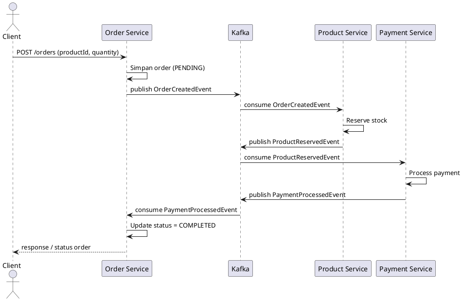
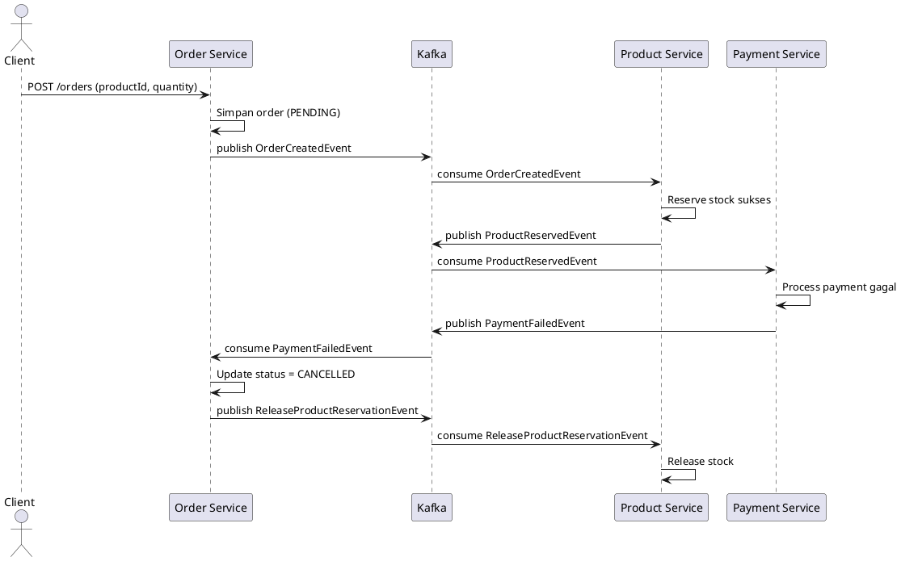
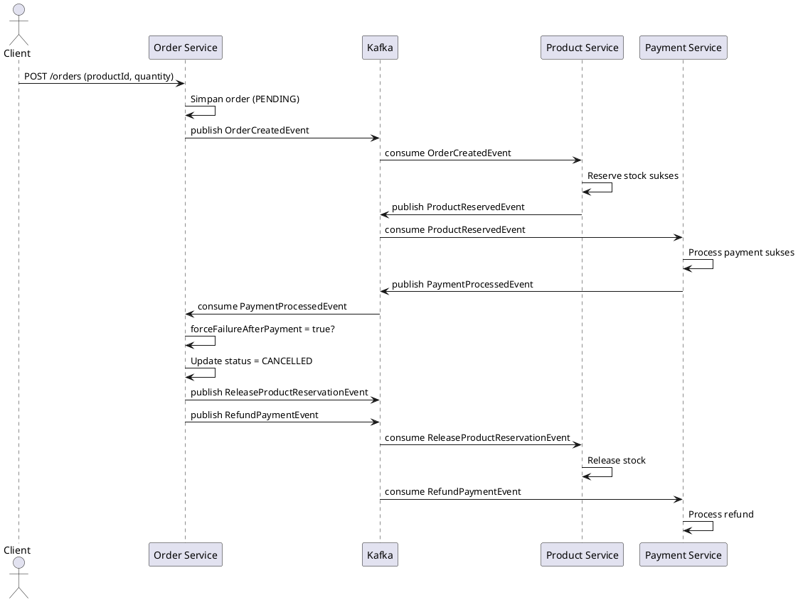

# Coding Comprehension: Saga Pattern pada `saga-ecommerce-kafka`

## 1) Tujuan Belajar
Setelah mempelajari materi ini, peserta diharapkan bisa:
- Menjelaskan kenapa Saga dipakai pada arsitektur microservices.
- Menelusuri alur event dari `order-service` ke `product-service` ke `payment-service`.
- Menjelaskan compensation transaction saat terjadi kegagalan.
- Menghubungkan konsep ke implementasi kode pada proyek ini.

## 2) Konteks Proyek
Proyek ini mensimulasikan proses checkout e-commerce dengan 3 service utama:
- `order-service`: membuat order dan mengelola status akhir saga.
- `product-service`: reserve/release stok.
- `payment-service`: proses payment/refund.

Kontrak event disimpan di module `common-event`, dan pengiriman event menggunakan Kafka.

## 3) Konsep Inti Saga (Choreography)
### Masalah yang diselesaikan
Dalam microservices, satu transaksi bisnis sering melibatkan banyak database. Transaksi ACID lintas service sulit/mahal dilakukan.

### Solusi Saga
Saga memecah transaksi besar menjadi rangkaian local transaction per service, diikat oleh event.

### Choreography vs Orchestration
- Choreography: tidak ada central coordinator; service bereaksi terhadap event.
- Orchestration: ada satu orchestrator yang mengatur langkah.

Proyek ini memakai **Choreography**.

## 4) Alur Utama Saga di Proyek Ini
1. Client membuat order ke `order-service`.
   - Input sekarang: `productId` + `quantity` (tanpa `amount`).
   - `order-service` ambil harga dari `product-service`, lalu hitung `amount = price x quantity`.
2. `order-service` publish `OrderCreatedEvent`.
3. `product-service` konsumsi event itu, lalu coba reserve stok:
- sukses -> publish `ProductReservedEvent`
- gagal -> publish `ProductReservationFailedEvent`
4. `payment-service` konsumsi `ProductReservedEvent`, lalu proses payment:
- sukses -> publish `PaymentProcessedEvent`
- gagal -> publish `PaymentFailedEvent`
5. `order-service` konsumsi event hasil akhir:
- bila sukses -> update status `COMPLETED`
- bila gagal -> update status `CANCELLED` dan trigger compensation.

## 5) Sequence Diagram Saga (PlantUML)
### 5.1 Happy Path

### 5.2 Failure + Compensation Path (Payment Gagal)

### 5.3 Forced Failure Setelah Payment Sukses (Refund + Release Stock)

## 6) Pemetaan Konsep ke Kode

### 6.1 Event Contract (`common-event`)
File utama:
- `common-event/.../event/OrderCreatedEvent.java`
- `common-event/.../event/ProductReservedEvent.java`
- `common-event/.../event/ProductReservationFailedEvent.java`
- `common-event/.../event/PaymentProcessedEvent.java`
- `common-event/.../event/PaymentFailedEvent.java`
- `common-event/.../event/ReleaseProductReservationEvent.java`
- `common-event/.../event/RefundPaymentEvent.java`
- `common-event/.../event/OrderCompletedEvent.java`
- `common-event/.../event/OrderCancelledEvent.java`

Penjelasan:
- Semua service mengacu ke kelas event yang sama untuk menjaga konsistensi schema payload.
- Event adalah kontrak integrasi antarmicroservice; perubahan field harus dikelola hati-hati agar backward compatible.
- Saat coding comprehension, baca field dari class event dulu sebelum menelusuri producer/consumer.

### 6.2 Order Domain dan Saga Finalizer (`order-service`)
File utama:
- `order-service/.../order/domain/OrderEntity.java`
- `order-service/.../order/domain/OrderStatus.java`
- `order-service/.../order/controller/OrderController.java`
- `order-service/.../order/service/OrderService.java`
- `order-service/.../order/integration/ProductCatalogClient.java`
- `order-service/.../order/kafka/SagaEventListener.java`
- `order-service/.../order/kafka/EventPublisher.java`
- `order-service/.../order/kafka/KafkaTopics.java`

Penjelasan:
- `OrderController` menerima request create order dari client (`productId`, `quantity`).
- `OrderService` hitung `amount` otomatis dari harga produk (`ProductCatalogClient`), simpan order, lalu publish `OrderCreatedEvent`.
- `SagaEventListener` menerima hasil dari service lain (`ProductReserved`, `PaymentProcessed`, `PaymentFailed`, dst) lalu memutuskan status akhir.
- Jika gagal, order dibatalkan dan order-service memicu event kompensasi (`ReleaseProductReservationEvent`, dan pada skenario tertentu `RefundPaymentEvent`).
- `KafkaTopics` menjadi referensi source-of-truth nama topic untuk producer/consumer.

### 6.3 Product Reservation (`product-service`)
File utama:
- `product-service/.../product/domain/ProductEntity.java`
- `product-service/.../product/controller/ProductController.java`
- `product-service/.../product/repository/ProductRepository.java`
- `product-service/.../product/service/ProductSagaService.java`
- `product-service/.../product/kafka/SagaEventListener.java`
- `product-service/.../product/kafka/EventPublisher.java`
- `product-service/.../product/kafka/KafkaTopics.java`

Penjelasan:
- Menyediakan katalog produk (termasuk `price`) via endpoint product.
- Menerima `OrderCreatedEvent`, lalu cek dan reserve stok.
- Jika stok cukup, publish `ProductReservedEvent`.
- Jika stok tidak cukup, publish `ProductReservationFailedEvent`.
- Saat menerima `ReleaseProductReservationEvent`, service mengembalikan stok sebagai bagian compensation.

### 6.4 Payment Processing (`payment-service`)
File utama:
- `payment-service/.../payment/domain/PaymentEntity.java`
- `payment-service/.../payment/domain/PaymentStatus.java`
- `payment-service/.../payment/repository/PaymentRepository.java`
- `payment-service/.../payment/service/PaymentSagaService.java`
- `payment-service/.../payment/kafka/SagaEventListener.java`
- `payment-service/.../payment/kafka/EventPublisher.java`
- `payment-service/.../payment/kafka/KafkaTopics.java`

Penjelasan:
- Menerima `ProductReservedEvent`, kemudian memproses pembayaran.
- Jika berhasil, publish `PaymentProcessedEvent`.
- Jika gagal, publish `PaymentFailedEvent`.
- Saat menerima `RefundPaymentEvent`, service mengeksekusi refund sebagai compensation lanjutan.

## 7) Cara Membaca Kode (Guided Comprehension)
Ikuti urutan ini agar tidak bingung:
1. Baca semua class event di `common-event` untuk paham payload.
2. Buka `KafkaTopics` di tiap service untuk lihat nama topic dan kontrak antar service.
3. Masuk ke `OrderController` dan endpoint create order.
4. Lanjut ke `OrderService` untuk lihat kapan event awal dipublish.
5. Cek `SagaEventListener` di `product-service` dan `payment-service` untuk reaksi terhadap event masuk.
6. Kembali ke `order-service` listener untuk finalisasi status dan compensation.

## 8) Debug Mental Model
Gunakan checklist ini saat tracing bug:
- Event awal benar-benar dipublish?
- Topic producer/consumer sama persis?
- Payload event sesuai kebutuhan service penerima?
- Status domain berubah sesuai expected transition?
- Saat gagal, compensation event terkirim?
- Aksi compensation benar-benar dieksekusi oleh consumer terkait?

## 9) Latihan Praktik
### Latihan A: Happy path
- Buat order dengan quantity kecil (contoh `SKU-1`, quantity `1` atau `2`).
- Prediksi urutan event sebelum eksekusi.
- Verifikasi `amount` terhitung otomatis, status order akhir, dan perubahan stok.

### Latihan B: Payment failure
- Buat order dengan quantity besar agar total `amount` melewati threshold payment (contoh `SKU-1`, quantity `30` -> amount `15000`).
- Prediksi event gagal dan compensation.
- Verifikasi order `CANCELLED` dan stok kembali.

### Latihan C: Forced failure setelah payment sukses
- Buat order dengan quantity kecil.
- Trigger endpoint force fail.
- Verifikasi dua compensation berjalan: release stock + refund.

## 10) Pertanyaan Diskusi untuk Tim
- Apa trade-off utama Saga choreography pada observability/debugging?
- Bagaimana mencegah event diproses dobel (idempotency)?
- Kapan perlu DLQ dan retry policy?
- Jika traffic tinggi, apa risiko race condition pada stok?
- Kapan lebih cocok pindah ke orchestration?

## 11) Risiko Produksi & Perbaikan Lanjutan
Implementasi demo ini bagus untuk belajar, tapi di produksi biasanya ditambah:
- idempotency key per command/event,
- outbox pattern untuk publish reliability,
- retry + dead-letter-topic,
- distributed tracing,
- monitoring lag consumer dan alerting,
- schema evolution strategy untuk event versioning.

## 12) Ringkasan Satu Kalimat
Saga di proyek ini adalah transaksi bisnis terdistribusi berbasis event, di mana kegagalan ditangani dengan **compensation action**, bukan rollback ACID lintas service.
